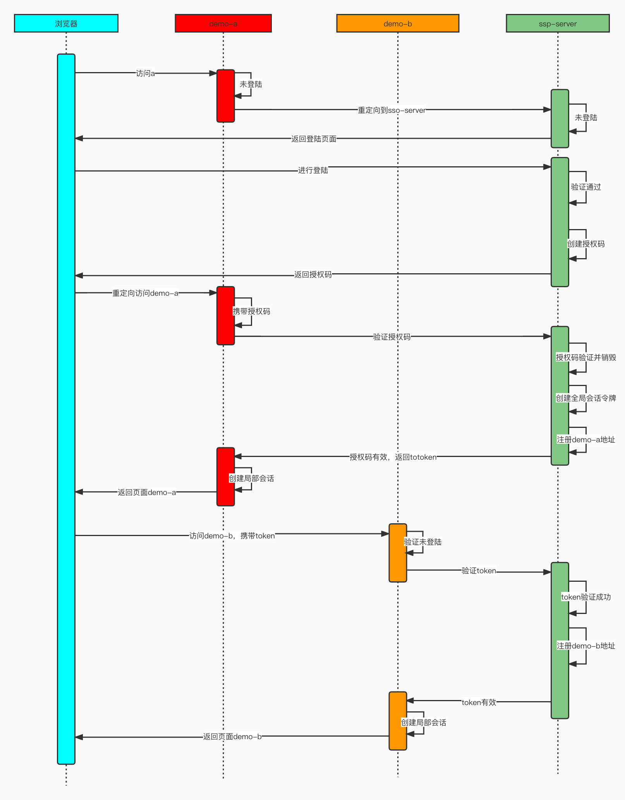
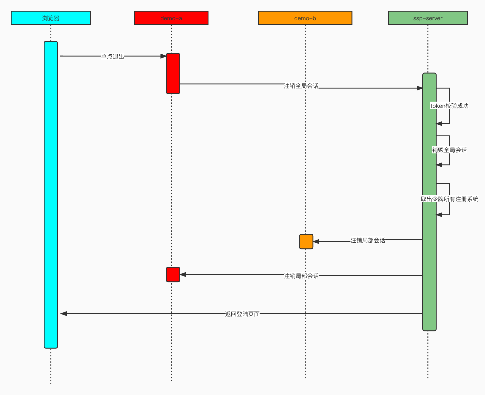

# 单点登录简介

分布式session：同一个网站，部署多台服务器，通过redis做统一会话存储

单点登录：存在A和B两个系统，不同系统间的会话认证

TGT：Ticket Granting Ticket

- 全局会话令牌token

TGC：Ticket Granting Cookie

- 会话cookie

ST：Service Ticket（临时票据）

- 授权码code

# 单点登录流程

## 单点登录

## 单点退出

# 测试

demo-a: http://localhost:8081/web/index

demo-b: http://localhost:8082/web/index